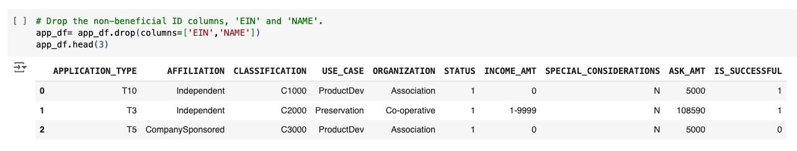

## Deep learning model for Alphabet Soup

### Purpose of the analysis

The analysis aims to develop a binary classifier using machine learning techniques and neural networks to predict the success of applicants funded by Alphabet Soup, a nonprofit foundation. By leveraging features from the provided dataset, the goal is to identify applicants with the highest likelihood of success in their ventures, aiding Alphabet Soup in making informed decisions about funding allocation.

### Description of the dataset

The dataset comprises over 34,000 organizations that have received funding from Alphabet Soup. It includes various metadata such as identification details, application type, sector affiliation, government classification, use case for funding, organization type, active status, income classification, special considerations, requested funding amount, and a binary indicator of whether the funding was effectively utilized.

### Model selection process

##### Model 1 from starCode_deepLearning.ipynb

- During preprocessing, two columns (EIN and NAME) that were neither targets nor features were dropped.
  
- Binning, a technique commonly used for categorical features, was used to reduce the number of unique values in two features (APPLICATION_TYPE & CLASSIFICATION) in the data, helping to prevent overfitting.
  
  
- The target was 'IS_SUCCESSFUL', and the features were the remaining variables in the dataset, except 'APPLICATION_TYPE' and 'CLASSIFICATION'.
  
- How many neurons, layers, and activation functions did you select for your neural network model, and why?
  Were you able to achieve the target model performance?
  What steps did you take in your attempts to increase model performance?

##### Model 2 from AlphabetSoupCharity_accBelow75.ipynb

- screenshots of 2 cols dropped, model with more neural networks, acc
  What variable(s) are the target(s) for your model?
  What variable(s) are the features for your model?
  What variable(s) should be removed from the input data because they are neither targets nor features?
  Compiling, Training, and Evaluating the Model

How many neurons, layers, and activation functions did you select for your neural network model, and why?
Were you able to achieve the target model performance?
What steps did you take in your attempts to increase model performance?

##### Model 3 from AlphabetSoupCharity_Optimization.ipynb

- screenshots of 1 col dropped, model with neural networks, acc
  What variable(s) are the target(s) for your model?
  What variable(s) are the features for your model?
  What variable(s) should be removed from the input data because they are neither targets nor features?
  Compiling, Training, and Evaluating the Model

How many neurons, layers, and activation functions did you select for your neural network model, and why?
Were you able to achieve the target model performance?
What steps did you take in your attempts to increase model performance?

### Conclusion
