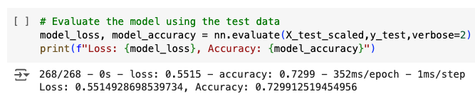

# Deep learning model for Alphabet Soup

## Purpose of the analysis

The analysis aims to develop a binary classifier using machine learning techniques and neural networks to predict the success of applicants funded by Alphabet Soup, a nonprofit foundation. By leveraging features from the provided dataset, the goal is to identify applicants with the highest likelihood of success in their ventures, aiding Alphabet Soup in making informed decisions about funding allocation.

## Description of the dataset

The dataset comprises over 34,000 organizations that have received funding from Alphabet Soup. It includes various metadata such as identification details, application type, sector affiliation, government classification, use case for funding, organization type, active status, income classification, special considerations, requested funding amount, and a binary indicator of whether the funding was effectively utilized.

## Model selection process

#### Model 1 from starCode_deepLearning.ipynb

- During preprocessing, two columns (EIN and NAME) that were neither targets nor features were dropped.
  
- Binning, a technique commonly used for categorical features, was used to reduce the number of unique values in two features (APPLICATION_TYPE & CLASSIFICATION) in the data, helping to prevent overfitting.
  
  
- The target variable is 'IS_SUCCESSFUL', and the features variables are the remaining variables in the dataset, except 'APPLICATION_TYPE' and 'CLASSIFICATION'.
  
- Also, both pd.get_dummies() and StandardScaler are used during preprocessing to prepare categorical and continuous features for training models.
- The model has two hidden layers and one output layer, and the first hidden layer has 7 neurons, and the second has 14 neurons. Also, the output layer has 1 neuron. In terms of activation functions, ReLU(Rectified Linear Activation) is used in the first and second hidden layers, which helps to accelerate the convergence of stochastic gradient descent compared to the other activation function like sigmoid. As for the output layer, Sigmoid activation is used for binary classification probems, representing the probability of belonging to the positive class.
  
- Based on the evaluation results, Loss was 0.5552, and accuracy was 0.7269, approximately 73%, which is below the target of 75% predictive accuracy. Therefore, the model did not achieve the desired performance level, and to improve the model's performance, the second model experiments with different architectures, especially changed the number of neurons for the second hidden layer (see below for Hyperparameter tuning in Model 2).
  

#### Model 2 from AlphabetSoupCharity_accBelow75.ipynb

- In preprocessing, two columns (EIN and NAME) that were neither targets nor features were dropped.
  
- Binning, a technique commonly used for categorical features, was used to reduce the number of unique values in two features (APPLICATION_TYPE & CLASSIFICATION) in the data, helping to prevent overfitting.
  
  
- The target variable is 'IS_SUCCESSFUL', and the features variables are the remaining variables in the dataset, except 'APPLICATION_TYPE' and 'CLASSIFICATION'.
  
- Also, both pd.get_dummies() and StandardScaler are used during preprocessing to prepare categorical and continuous features for training models.
- Different from Model 1 above, the number of neurons for the second hidden layer was increased from 14 to 28 to attemp to increase model performance. So, in this model, there were two hidden layers and one output layer, and the first hidden layer has 7 neurons, and the second has 28 neurons. Also, the output layer has 1 neuron. In terms of activation functions, similar to Model 1, ReLU(Rectified Linear Activation) was used in the first and second hidden layers, and Sigmoid activation is used for the output layer, squashing the output between 0 and 1.
  
- Based on the results, Loss was 0.5515, and accuracy was 0.7299, approximately 73%, which is below the target of 75% predictive accuracy. Therefore, the model did not achieve the desired performance level, and to improve the model's performance, the last model adds another feature, NAME, that could be useful for prediction (see below for Feature engineering in the last model).
  

#### Model 3 from AlphabetSoupCharity_Optimization.ipynb

- Different from the models above, in this model, just one feature variable, EIN, was dropped (Feature engineering) to increase model performance.
  

- Agian, binning was used to reduce the number of unique values in three features variables (NAME, APPLICATION_TYPE, & CLASSIFICATION) in the data, helping to prevent overfitting.
  
  
  
- The target variable is 'IS_SUCCESSFUL', and the features variables are the remaining variables in the dataset, except 'APPLICATION_TYPE' and 'CLASSIFICATION'.
  
- Also, both pd.get_dummies() and StandardScaler are used during preprocessing to prepare categorical and continuous features for training models.
- Similar to Model 1, the last model has two hidden layers and one output layer, and the first hidden layer has 7 neurons, and the second has 14 neurons. Also, the output layer has 1 neuron. In terms of activation functions, ReLU is used in the first and second hidden layers, and Sigmoid was used for the output layer.
  
- Based on the evaluation results, Loss was 0.4727, and accuracy was 0.7862, approximately 79%, which is above the target of 75% predictive accuracy. Therefore, the model did achieve the desired performance level.
  

## Conclusion

The goal of the analysis is to develop a binary classifier using machine learning techniques and neural networks to predict the success of applicants funded by Alphabet Soup, a nonprofit foundation.

The initial model dropped irrelevant variables (EIN and NAME) and used binning for APPLICATION_TYPE and CLASSIFICATION to prevent overfitting. However, it fell short of the 75% predictive accuracy target, achieving only around 73%.

In Model 2, hyperparameter tuning increased the number of neurons in the second hidden layer from 14 to 28, but the accuracy remained below 75%.

In the final model, the predictive accuracy reached 79% by reintroducing the NAME variable, which was also binned to reduce categories and prevent overfitting. Therefore, the last model, which includes the binned NAME variable, achieved the desired predictive accuracy and should be adopted to aid Alphabet Soup in making informed decisions about funding allocation.
